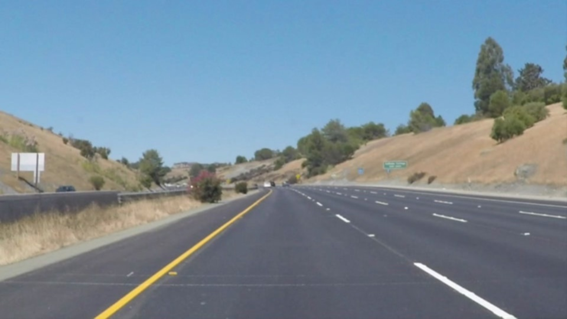
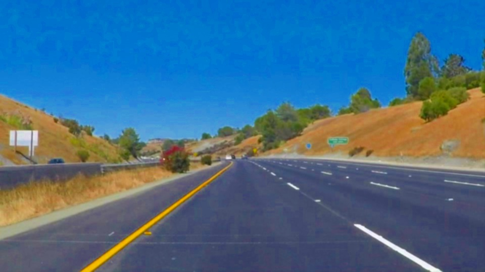
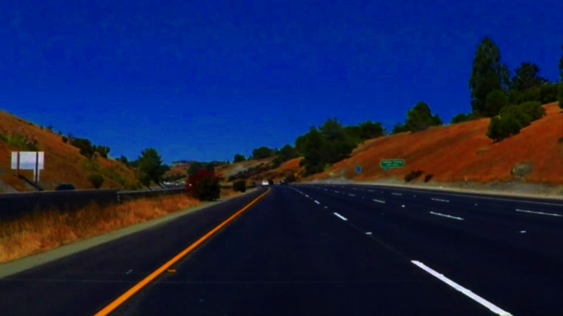
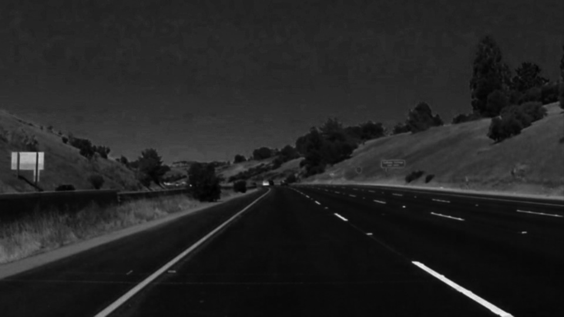
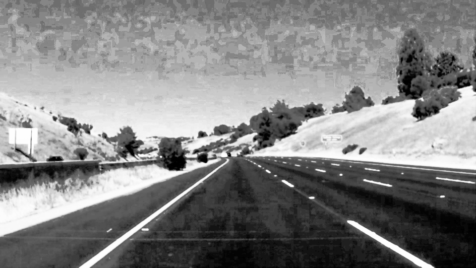
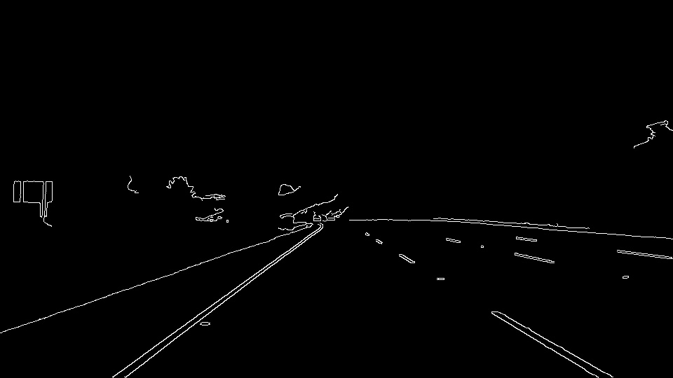
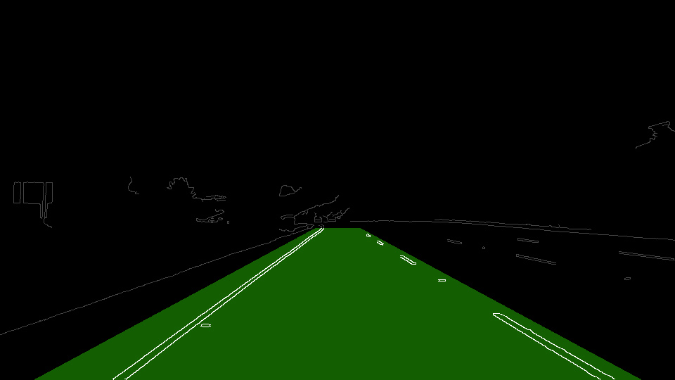
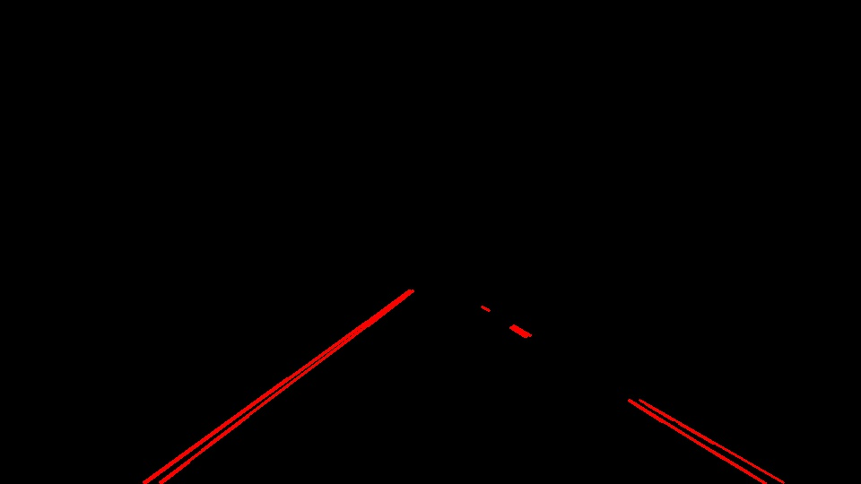
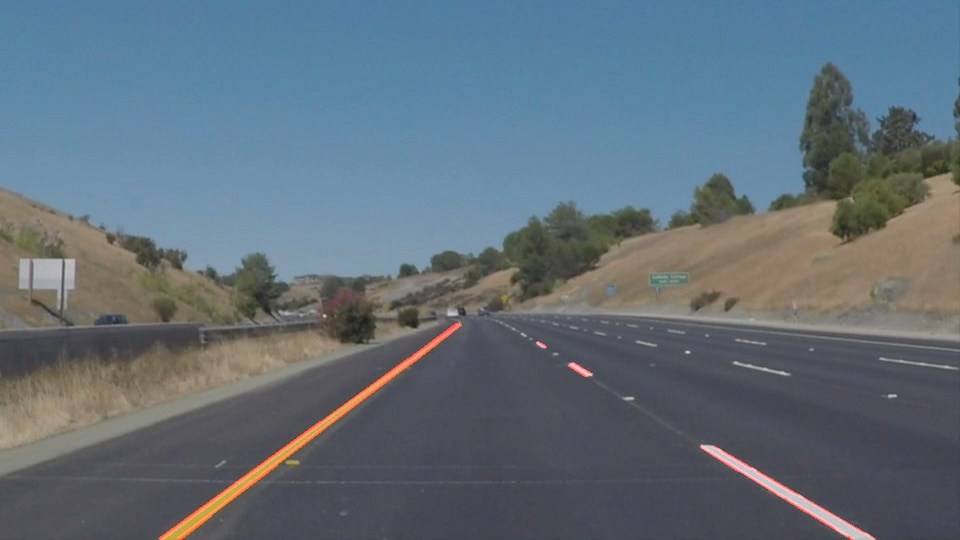

# **Finding Lane Lines on the Road** 

The goals / steps of this project are the following:
* Make a pipeline that finds lane lines on the road
* Reflect on your work in a written report

---
The source-code of the project can be found in the editted Jupyter notebook provided by the study program [here](P1.ipynb).

### Reflection

### 1. Describe your pipeline. As part of the description, explain how you modified the draw_lines() function.

The lane lines detection algorithm is based on the [Hough transformation](https://en.wikipedia.org/wiki/Hough_transform). In order to obtain satisfactory results the input images had to be preprocessed. For the porpouse of line detection I have used namely the following steps:

 1. Blur the image in order to get rid of noise that could confuse the Canny edge detector in later steps.\

 2. Saturate the collors of the image (which is practically done by converting the image into the [HSL](https://en.wikipedia.org/wiki/HSL_and_HSV) colour-space and multiplying the S values by 2.5).\

 3. Increase the [gamma](https://en.wikipedia.org/wiki/Gamma_correction) to make the image more contrasty.\

 4. Convert the image to greyscale, because the implementation of the edge detector in the library we used requires a one channel image on the input.\

 5. Use the histogram equalization so the represented colours are spreaded through the whole range. This helps to cope with an underexposed or overexposed images to some extend.\

 6. Use a [Canny edge detector](https://en.wikipedia.org/wiki/Canny_edge_detector) to detect the edges in the image.\

 7. Applying the mask to the result of the previous step to limit our attention to the area of interrest. The following image depicts what area is used, it is not explicitly created during the processing, rather only an image with the pixels inside of the region of interrest is created.\

 8. Run the probabilisic [Hough line detector](https://docs.opencv.org/2.4/doc/tutorials/imgproc/imgtrans/hough_lines/hough_lines.html) implemented in the OpenCV library.\

 9. Finaly the founded lines were merged into the original image.\
 

To get a single line out of the lines detected by the Hough edge detection method, I have redefiened the draw_lines function so it eliminates all lines for which the angle is not in range between 30 and 45 for each side separately and computed a weighted average of the k and q koeficient of the line equation y=kx+q, weighted by the delected line length. As an extension to show the lines nicely in the video, I have also computed the lines intersection (if lines on both sides were detected for the particular frame of video) and displayed the lines line of length of 95% from the very bottom to the intersection.

### 2. Identify potential shortcomings with your current pipeline

The pipeline is set for a specific focal length and range of angles of camera to the road. These two parameters influences the actual angles under which the lane lanes projects into the image and which are used to select the which of the detected lines are of the interrest of the algorithm. The fix angles vulues would also struggle with the situation when the car changes the line.

The algorithm is also disigned just for detection of the lines in simple situations, as for example the line lanes on a highway, which is quite stright in contrast to the roads in the cities or small roads. Not even mentioning the situation when the road is under repair and there are another temporary lines drawn on top of the common ones in another color.

Third limitation that I can think of are the difficult light conditions, for example during the night when there are only certain areas highlighted, by our car and the others. Note here, that a comman car does not have both lights shadding light on the symetrical areas in order not to blind drivers in the other direction. 

### 3. Suggest possible improvements to your pipeline

There are many ways to improve the lane line detection algorithm. One of them could be usage of an adaptive region of interest based on several previous images, which would compensate the camera inclination. The aspect that has to be taken into the consideration here is the road bumps, which may.

The other improvement could be connectioning the edge detection algorithm with a sensor of steering and a prediction model trying to detect if the driver changes lines.